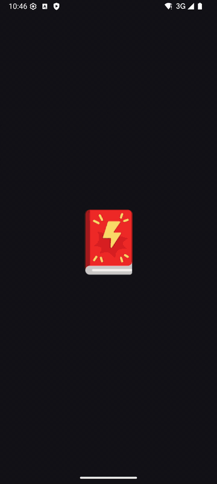

  

    <h2>MangaD</h2>
    
A simple manga reader for Android.

      
    
    

  <strong>English</strong> • <a href="README_RU.md">Русский</a>

---

MangaD lets you find manga, manhwa and manhua, read them, and keep track of
where you are. No account, no sign-up.

### What you can do

- **Find something to read**: browse the latest updates, search by title, or
  filter by genre.
- **Read your way**: webtoon scroll, page by page (left to right or right to
  left) or vertical pages, with page fitting, brightness and orientation
  settings.
- **Keep a library**: save the series you follow and see when new chapters
  come out.
- **Pick up where you left off**: your reading history remembers the last
  chapter you read in every series.
- **Light and dark themes**: or let it follow your phone.

### Coming soon

- Backup and restore for your library and history
- AniList and MyAnimeList sync
- Library categories
- Offline chapters inside the app
- More sources
- Reading stats

Have an idea? Tell us on [Discord](https://discord.gg/6CQ6u64dca).

### Disclaimer

MangaD is not affiliated with any of the content shown in the app. It reads
from sources that are freely available in any web browser.
